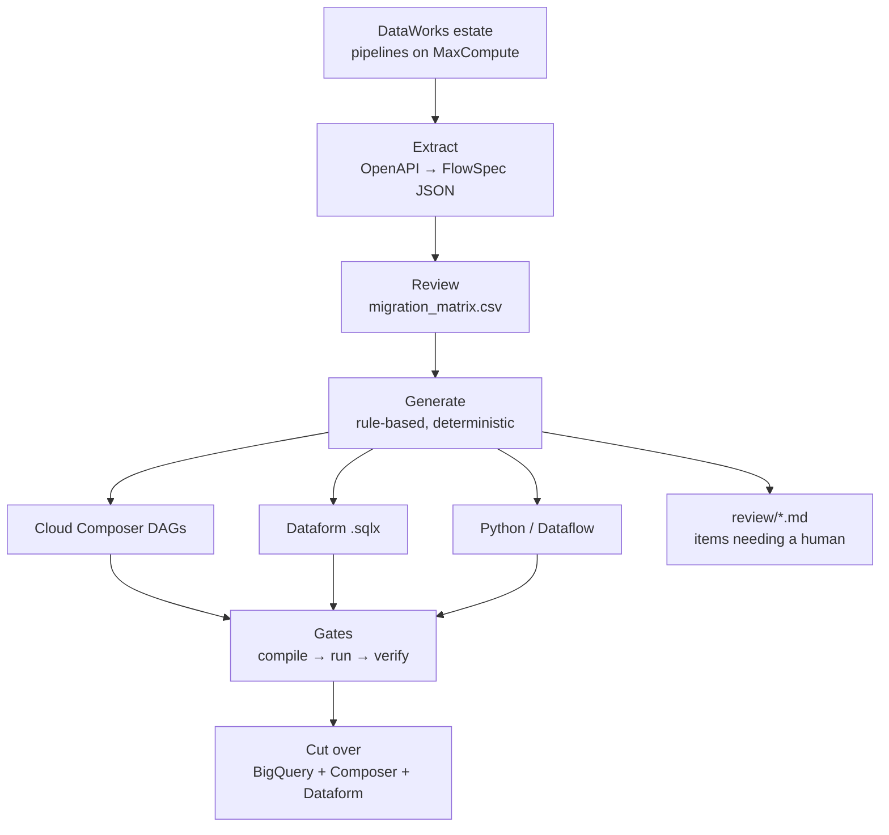

# DataWorks → GCP Pipeline Migration Guide

> **Last reviewed:** 2026-09-22

Migrating enterprise data pipelines from **Alibaba Cloud DataWorks (on
MaxCompute)** to a code-driven **Google Cloud analytics platform** — with a
metadata-driven toolkit that does the mechanical work.

| Concern | DataWorks (source) | Google Cloud (target) |
| --- | --- | --- |
| Orchestration / scheduling | Operation Center | **Cloud Composer** (managed Apache Airflow) |
| SQL transformation | Data Studio (visual SQL) | **Dataform** (`.sqlx`) |
| Warehouse / compute | MaxCompute | **BigQuery** |
| Data integration (sync) | Data Integration | **BigQuery Data Transfer / Datastream / Dataflow** |
| Governance / metadata | Data Map | **Dataplex** |

---

## Start here

**→ [Documentation index](docs/README.md)**

Or jump straight to your reading path:

| You are… | Start at |
| --- | --- |
| **New to the stack** | [01 · Concepts](docs/01-concepts.md) |
| **Planning a migration** | [03 · Migration playbook](docs/03-migration-playbook.md) |
| **Running the toolkit** | [`code/README.md`](code/README.md) |
| **Learning by doing** | [Tutorial · End-to-end on GCP](docs/tutorials/end-to-end-on-gcp.md) |
| **Extending the toolkit** | [05 · Tools architecture](docs/05-tools-architecture.md) |

Unfamiliar term? → [Glossary](docs/reference/glossary.md)

---

## How it works



Metadata is extracted from DataWorks via its OpenAPI, reviewed in a
human-editable CSV, and turned into GCP artifacts by a **rule-based generator**.
Four gates — `generate → compile → run → verify` — each stop the pipeline on
failure. Anything the generator will not convert with confidence is **flagged
for a human** rather than guessed at.

Full walkthrough: [03 · Migration playbook](docs/03-migration-playbook.md).

---

## Quick start

```bash
cd code
uv sync                                   # install dependencies
cp .env.example .env                      # then fill in your values
uv run migrate/migrate.py all \
    --flowspec extract/sample_flowspec_house_buying.json
```

The sample FlowSpec lets you run the whole pipeline **without Alibaba
credentials**. All commands run from `code/`; see
[`code/README.md`](code/README.md) for the full CLI and prerequisites
(GCP project with BigQuery, gcloud ADC, the Dataform CLI).

---

## The 60-second summary

1. **DataWorks is one coupled UI.** It fuses orchestration, transformation,
   integration and governance into a single drag-and-drop product.
2. **GCP deliberately splits those concerns** into code-first services. So this
   is a *decomposition*: every node must be routed to the right service — see
   the [routing matrix](docs/02-architecture-and-routing.md).
3. **Extract via the REST API, not the UI.** Two API versions are required:
   `2024-05-18` for workflows/nodes, `2020-05-18` for table DDL.
4. **Generate, then prove it.** The gates prove the migration is *structurally*
   sound; only reconciliation against the source proves the numbers.
5. **Watch the three classic traps:** ODPS→BigQuery SQL semantics, the
   `${bizdate}` off-by-one, and string partition columns that don't map to
   BigQuery partitioning.

---

## Repository layout

```
docs/          the guide — start at docs/README.md
code/          runnable toolkit (extract · classify · migrate · gcp · tests)
data/          extraction output + generated project (git-ignored)
```

## Contributing

See [`CONTRIBUTING.md`](CONTRIBUTING.md) — in particular the **ownership
contract** that keeps the documentation from drifting into contradicting
itself. Recent changes are in [`CHANGELOG.md`](CHANGELOG.md).

## License

[Apache-2.0](LICENSE). This repository contains original documentation and
code, plus a rewrite of concepts from publicly available Alibaba Cloud and
Google Cloud documentation.

> [!NOTE]
> Verify all APIs and product capabilities against the current official docs at
> execution time — both platforms move quickly.
